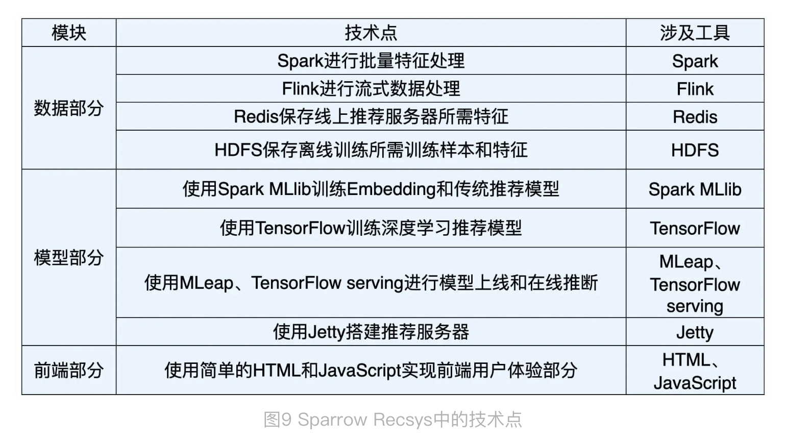

# Notes


## Steps to learn sparrow recsys

[ ] whole picture of this project
    [x] project structure
    [x] how to run the project
    [ ] connections between codes 
[ ] re-produce the code step by step (roll back the code based on git log maybe)
    [ ] the order of re-produce
    [ ] understand the code and re-produce


## Features of Sparrow RecSys

1. [x] Recommendation in main page
   1. Sorted with the average historical scores of user for each category 
2. [ ] Related movies recommendation
   1. [ ] Based on DL embedding techniques
3. [ ] Recommend for you (users)


## Project Structure

1. src: main code for online service including 3 components
   1. resource
      1. webroot/  collection.html, index.html, movie.html and user.html is the struture of the front-end pages
   2. java
      1. offline
      2. near line
      3. online
2. RecPySpark: Offline training for 
   1. embedding 
   2. feature engineering
   3. CF algorithm
3. TFRecModel: offline training for DL models including embeddingMLP, deepFM..
4. 


### Tools




### How to run the code

```shell
# Python env
conda activate rec_sys

# TFRecModel run (just a demo, model is not saved)
python TFRecModel/src/com/sparrowrecsys/offline/tensorflow/DeepFM.py 

# RecPySpark 
## userEembdding, item2VectorEmbedding and itemGraphEmb are saved in src/main/resources/webroot/modeldata2/
python RecPySpark/src/com/sparrowrecsys/offline/pyspark/embedding/Embedding.py

# src: to run the server, there are two ways, and the config are [here](src/main/java/../online/util/Config) 
#     1. load all data from the local file 
#         1. config: EMB_DATA_SOURCE = Config.DATA_SOURCE_FILE;
#         2. find ResSysServer.java, then select `run`
#     2. load part of the data to Redis; then load data from local files and Redis
#         1. initialize Redis:  redis-server  (the default port is 6379)
#         2. load data to Redis: 
#             1. change Embedding.scala: main funciton -> saveToRedis=true
#             2. run it
#         3. public static String EMB_DATA_SOURCE = Config.DATA_SOURCE_REDIS
#         4. find ResSysServer.java, then select `run`
```

### Data flow 

1. original sample data: /src/main/resources/webroot/sampledata/ 
   1. ratings.csv, movies.csv, links.csv ([data explanation](https://time.geekbang.org/column/article/288943))
2. Combine ratings and movies data, save it to train and test data: /src/main/resources/webroot/sampledata/
   1. testSamples 
   2. trainSamples
3. Embedding data: 
   1. /src/main/resources/webroot/modeldata: embedding from DL model
   2. /src/main/resources/webroot/modeldata: embedding with PySpark


### Online Service

1. Server
   1. [5 Sevelets](../src/main/java/com/sparrowrecsys/online/RecSysServer.java)
      1. MovieService()
      2. UserService()
      3. SimilarMovieService()
      4. RecommendationService()
      5. RecForYouService()
2. Storage: three layers
   1. Distribution file systems (src/main/resources in this case)
      1. model. all offline feature,
   2. Redis
      1. features of current features and users
   3. Cache
      1. All of the item features
      2. user features got from Redis based on uid 


   
## Next step

## TODO 

1. [ ] why pyspark
2. [ ] [局部敏感哈希, embedding 最小临近搜索](https://time.geekbang.org/column/article/301739)
3. [ ] src online code strucuture
4. [ ] [Book Recommended](https://time.geekbang.org/column/article/292682)
5. [x] [多路召回的代码在哪儿？](https://time.geekbang.org/column/article/299494)
   1. src/.../online/recprocess/SimilarMovieProcess.java
6. [x] DL models are trained in TFRecModel but not saved; is there the saved model in src directory??
   1. src/main/resource/modeldata


## Redis

```shell
# Reference url: https://redis.io/docs/getting-started/
# install redis 
brew instal redis
# start redis 
redis-server
# launtch redis cli: 
redis-cli

```

